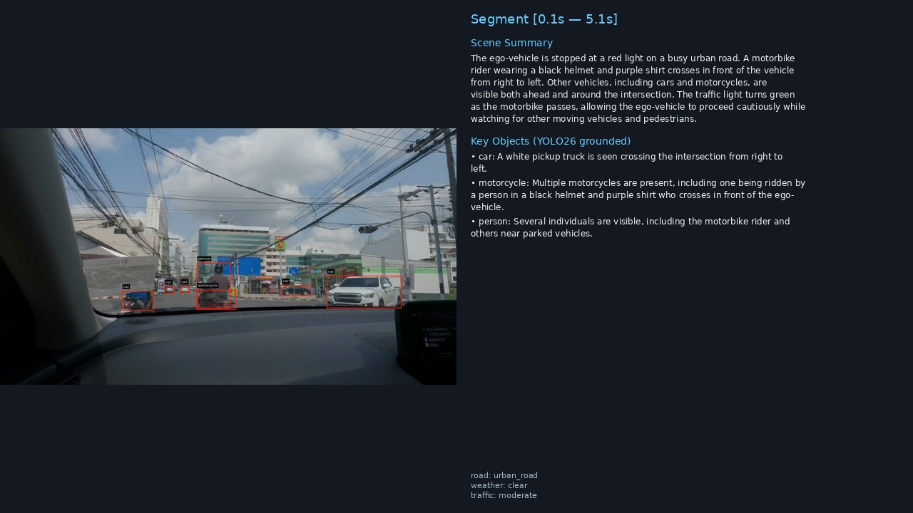
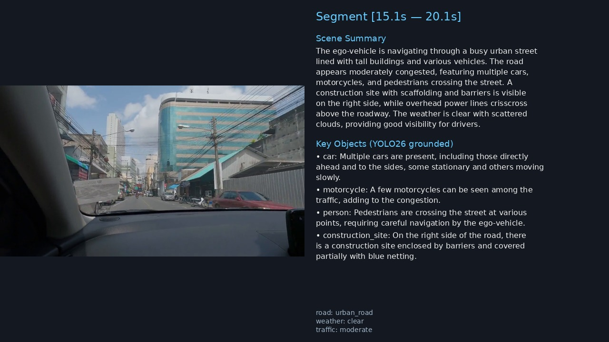
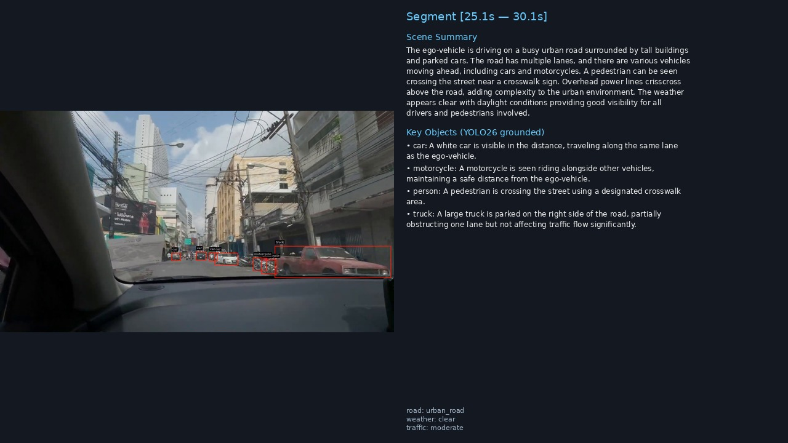

# DeepStream-VLM

> Real-time video understanding pipeline powered by **NVIDIA DeepStream 9.0** and **Cosmos-Reason2-8B** Vision Language Model, with optional open-vocabulary object grounding via **YOLOE**.

> **First open-source example** that combines `DeepStream + YOLOE (open-vocabulary detection/segmentation) + a VLM` in a single GStreamer pipeline.

---

## What it does

A GStreamer pipeline that splits a video stream into temporal windows (e.g. 5-second segments) and, for each segment, produces structured scene analysis from a VLM. Three detector modes are available — pick one at runtime via `--detect-config`:

| Mode | `nvinfer` config | Vocabulary | Mask support |
|---|---|---|---|
| **Pure VLM** (no `--detect`) | — | — | — |
| **YOLO26** | `config_infer_yolo26.txt` | Closed (80 COCO classes) | No |
| **YOLOE-26 detect** | `config_infer_yolo26e.txt` | **Open-vocab** (your classes at export) | No |
| **YOLOE-26 seg** | `config_infer_yolo26e_seg.txt` | **Open-vocab** | **Yes** (rendered in OSD output) |

Pipeline topology:

```
         ┌─ (no detector) ──────────────────────────────┐
uridecodebin → nvstreammux → [nvinfer(YOLO)] → nvvideoconvert → nvvllmvlm (VLM)
                                 │                                     │
                                 ▼                                     ▼
                    detection hints injected             Kafka publish + JSON
                    into VLM user_prompt                  (+ optional OSD MP4)
```

---

## Sample output

Left: middle frame of a 5-second segment. Right: VLM scene summary + YOLO-grounded key objects.

<p>
  <br>
  <br>
  
</p>

---

## Quickstart

Prerequisites: Docker w/ NVIDIA Container Toolkit, NVIDIA driver 580+, an RTX 4090 or equivalent Ada/Ampere GPU (≥24 GB VRAM), an [NGC API key](https://ngc.nvidia.com) for the FP8 VLM checkpoint download.

### 1. Clone and bring up the stack

```bash
git clone https://github.com/IJLee0812/DeepStream-VLM.git
cd DeepStream-VLM
cp .env.example .env          # fill in NGC_API_KEY
docker compose up -d          # ds9-vlm-dev + Kafka + Zookeeper
docker exec -it ds9-vlm-dev bash
```

### 2. Download the VLM (once, ~9 GB FP8)

```bash
# inside the container
ngc config set                 # paste NGC_API_KEY, org=nvidia
ngc registry model download-version \
    "nim/nvidia/cosmos-reason2-8b:1208-fp8-static-kv8" \
    --dest /workspace/models/hub
```

### 3. Pick a detector and prepare its ONNX

```bash
# Option A — closed-vocab YOLO26 (80 COCO classes)
python3 scripts/download_model.py --model yolo26 --size m
python3 scripts/export_yolo26.py -w models/yolo26m.pt --simplify
# → models/yolo26m.onnx

# Option B — open-vocab YOLOE-26 (detection, you pick the classes)
python3 scripts/download_model.py --model yoloe --size m
python3 scripts/export_yoloe.py \
    -w models/yoloe-26m-seg.pt \
    --custom-classes "vehicle,person,motorcycle,traffic_sign,traffic_light,truck,bus,bicycle" \
    --dynamic --simplify
# → models/yoloe-26m-seg.onnx + models/yoloe-26m-seg.labels.txt

# Option C — open-vocab YOLOE-26 (segmentation, masks in OSD output)
python3 scripts/export_yoloe_seg.py \
    -w models/yoloe-26m-seg.pt \
    --custom-classes "vehicle,person,motorcycle,traffic_sign,traffic_light,truck,bus,bicycle" \
    --dynamic --simplify --build-engine
# → models/yoloe-26m-seg-mask.onnx + .engine + .labels.txt
```

> **Seg needs `--build-engine`.** On DS 9.0 / TRT 10 / CUDA 13 the `nvinfer`
> JIT path aborts with `NVRTC_ERROR_COMPILATION` when the ONNX embeds the
> custom `EfficientNMSX_TRT` / `ROIAlignX_TRT` ops. `trtexec` builds the
> same engine cleanly; `nvinfer` then only deserializes it.

### 4. Run the pipeline

```bash
# Pure VLM (no grounding)
python3 main.py assets/videos/sample.mp4 \
    -c configs/config_driving_scene.yaml \
    --output results/out.json \
    --kafka-bootstrap localhost:9092 --topic vlm-results

# YOLO26 detection → VLM grounded on 80 COCO classes
python3 main.py assets/videos/sample.mp4 \
    -c configs/config_driving_scene.yaml --detect \
    --output results/out.json \
    --kafka-bootstrap localhost:9092 --topic vlm-results

# YOLOE detection → VLM grounded on your open-vocab class list
python3 main.py assets/videos/sample.mp4 \
    -c configs/config_driving_scene.yaml --detect \
    --detect-config configs/config_infer_yolo26e.txt \
    --output results/out.json \
    --kafka-bootstrap localhost:9092 --topic vlm-results

# YOLOE segmentation → VLM grounding + visualization MP4 with instance masks
python3 main.py assets/videos/sample.mp4 \
    -c configs/config_driving_scene.yaml --detect \
    --detect-config configs/config_infer_yolo26e_seg.txt \
    --detect-output results/seg_osd.mp4 \
    --output results/out.json \
    --kafka-bootstrap localhost:9092 --topic vlm-results
```

Add `--dry-run` to skip Kafka and print results to stdout. All flags:

| Flag | Meaning |
|---|---|
| `-c`, `--config` | YAML config (model + prompts + segment window) |
| `--detect` | Enable object-detection branch (requires a compatible `--detect-config`) |
| `--detect-config` | nvinfer `.txt` path; default = `configs/config_infer_yolo26.txt` |
| `--detect-output` | Write an OSD MP4 (bbox + instance masks for seg configs) |
| `--output` | Save all segments as a JSON array |
| `--kafka-bootstrap`, `--topic` | Kafka producer target (default `localhost:9092` / `vlm-results`) |
| `--dry-run` | Skip Kafka |

---

## Why open-vocab matters

YOLOE bakes arbitrary class-name embeddings into the detector head at export time (`model.set_classes(...)` → `head.fuse(txt_pe)`). You can ship a driving-scene model with `{vehicle, pedestrian, traffic_sign}` or a retail-camera model with `{shelf, cart, person}` from the same checkpoint — no retraining, no runtime text-prompt cost during inference. The detection hints the VLM receives match *your* vocabulary instead of COCO-80.

---

## Project layout

```
DeepStream-VLM/
├── main.py                               # entrypoint
├── docker-compose.yml                    # ds9-vlm-dev + Kafka + Zookeeper
├── plugin/
│   ├── gstnvvllmvlm.py                   # GStreamer VLM plugin
│   ├── vlm_utils.py                      # pure logic (host-testable)
│   ├── output_schema.py                  # Pydantic schema for VLM output validation
│   └── config_loader.py                  # YAML config singleton
├── src/
│   ├── vllm_ds_app_kafka_publish.py      # pipeline builder + Kafka + OSD branch
│   └── consumer.py                       # optional Kafka consumer
├── scripts/
│   ├── download_model.py                 # fetch yolo26 / yoloe weights
│   ├── export_yolo26.py                  # closed-vocab ONNX export
│   ├── export_yoloe.py                   # open-vocab detect ONNX export
│   └── export_yoloe_seg.py               # open-vocab seg ONNX + trtexec engine
├── configs/
│   ├── config_infer_yolo26.txt           # nvinfer: YOLO26 (closed)
│   ├── config_infer_yolo26e.txt          # nvinfer: YOLOE detect (open)
│   ├── config_infer_yolo26e_seg.txt      # nvinfer: YOLOE seg (open)
│   └── config_driving_scene.yaml         # unified VLM prompt + segment config (pure VLM & --detect)
├── lib/
│   ├── libnvdsinfer_custom_impl_Yolo.so          # YOLO bbox parser (DS 9.0)
│   └── libnvdsinfer_custom_impl_Yolo_seg.so      # YOLO seg parser (DS 9.0)
└── tests/
    ├── unit/                             # host-runnable
    ├── integration/                      # GStreamer auto-mocked
    └── e2e/                              # Docker + GPU required
```

---

## Tests

```bash
# host — unit + integration, no GPU/Docker needed
uv venv .venv --python 3.10
uv pip install --python .venv/bin/python pytest pytest-mock pytest-cov PyYAML
.venv/bin/pytest tests/unit tests/integration -q   # 238 tests, ~0.2s

# full suite inside Docker
pytest tests/ -v
```

Lint: `ruff check . && ruff format --check .` (config in `pyproject.toml`).

---

## Tech stack

| Component | Version | Role |
|---|---|---|
| DeepStream | 9.0 | GStreamer GPU pipeline |
| Cosmos-Reason2-8B | FP8 | Vision Language Model |
| vLLM | **0.14.0** (pinned) | VLM inference engine (FP8 requires this exact version) |
| YOLO26 | m/s/l | Closed-vocab detector |
| YOLOE-26 seg | m/s/l | **Open-vocab** detector + segmentor |
| TensorRT | 10.14 | nvinfer backend |
| CUDA | 13.1 | Toolchain |
| Kafka | 7.6 | Result publishing |

## References

- [NVIDIA DeepStream SDK 9.0](https://developer.nvidia.com/deepstream-sdk)
- [deepstream-vllm-plugin](https://github.com/NVIDIA-AI-IOT/deepstream_reference_apps/tree/master/deepstream-vllm-plugin) — upstream `nvvllmvlm`
- [Cosmos-Reason2-8B-FP8](https://www.jetson-ai-lab.com/models/cosmos-reason2-8b/)
- [DeepStream-Yolo](https://github.com/marcoslucianops/DeepStream-Yolo) / [DeepStream-Yolo-Seg](https://github.com/marcoslucianops/DeepStream-Yolo-Seg) — custom nvinfer parsers
- [Ultralytics YOLOE](https://docs.ultralytics.com/models/yoloe/) — open-vocabulary YOLO

## License

Apache 2.0
